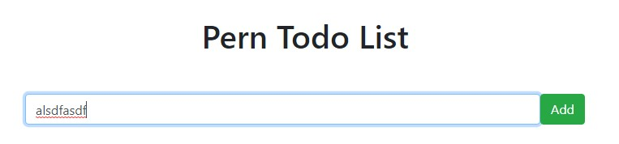
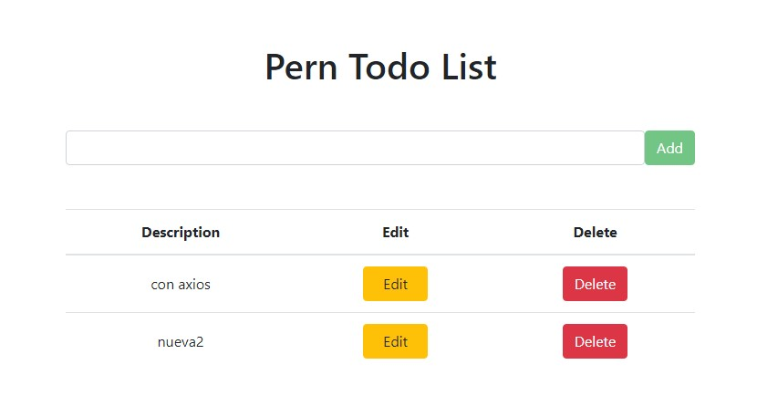
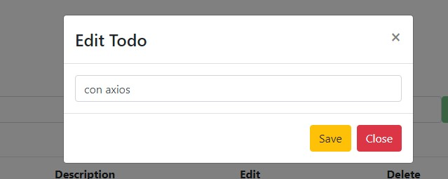

### Todo Web App Full Stack PERN (PostgreSQL Express React Node)
Este repositorio es sólo el **backend** del proyecto, el frontend lo encontrarás aquí:  
[https://github.com/gabyballester/todo-web-app-front-react-fullstack-pern](https://github.com/gabyballester/todo-web-app-front-react-fullstack-pern)
***
#### Sobre el proyecto 
- DB config en archivo independiente
- Archivos de rutas, controlador y configuración de DB en archivos independientes.
- Queries SQL en archivo independiente.
- CRUD de "to-dos"
- Async/Await
***
#### Crear la base de datos de PostgreSQL
En mi caso he elegido el nombre: `perntodo`

#### Crear tabla
```
CREATE TABLE todo(
  todo_id SERIAL PRIMARY KEY, -- será único
  description VARCHAR(255)
);
```
- Poner el nombre de la base de datos en archivo /config/db.js
database: "**perntodo**"

#### Instalar dependencias
`yarn install`

#### Arranque del proyecto
`yarn start`

Url base: http://localhost:5000/

#### Capturas del proyecto📷



